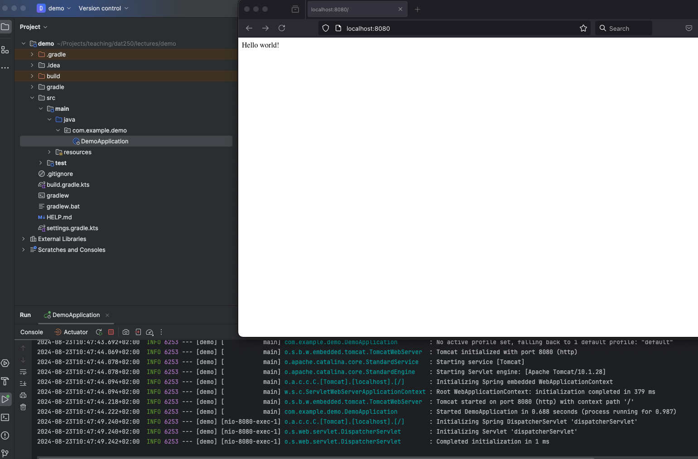

# DAT250: Software Technology Experiment Assignment 1

## Introduction

The goal of this assignment is to ensure that you have a working Software Development Environment installed on your computer, which will be needed in the remainder of this course. As part of the installation, you will have to validate that the installed software development environment is working properly.

If you encounter problems during the installation of the software development environment, then please post your questions and issues on the Canvas discussion forum for the DAT250 course.

Note that this is an **individual** assignment (see Hand-in at the end of the document).

## Installation: Software Development Environment

You must make sure that you have the following installed on your PC:

- Java Development Environment (JDK) in at least version `>= 21`,

- An Integrated Development Environment (IDE) or sufficiently sophisticated code editor, 

- The _Gradle_ software build tool in at least version `>= 8`,

- A _Git_ client,

- Node.js (`>= 20`) and NPM (`>= 10`), which will be needed later for the SPA assignment.

- An environment to execute _containers_, e.g. _Docker_.

In addition, you must make sure that you have a GitHub as well as an account in DockerHub.

### Java

The minimum requirement for this course is a Java Development Kit (JDK), i.e. availability of the binaries `java` and `javac` on the `$PATH`, in version _21_.

With the acquisition of Sun Microsystems by Oracle and the associated changes to the licensing of the original Java virtual machine and JDK, a plethora of Java distributions has become available, e.g. Oracle JDK, OpenJDK, Eclipse Adoptium, Amazon Coretto, etc.

To ease the management of multiple Java editions on one machine, we recommend using [SDKman](https://sdkman.io).

Follow the instructions [here](https://sdkman.io/install) to install _SDKman.
**Note**: If you are using windows, you first have to either install [Windows Subsystem for Linux (WSL)](https://learn.microsoft.com/en-us/windows/wsl/install) or install a CYGWin environment (If you install the Git SCM client for windows you will actually get such a CYGwin environment via _Git-Bash_).

It is also possible to not use WSL or CYGwin and to use the builtin CMD.exe or PowerShell, however, we would recommend to use a POSIX shell for the remainder of 
the course as this will make working with containers and Docker much easiert. Also SDKman eases installation of Java versions a lot!

After you have _SDKman_ installed, you can easily install and switch between JDKs.

Type
```bash
sdk install java
```
to install the latest JDK.
After installation you will be prompted whether you want to use it as your default:
Just say (Y)es!

Otherwise, you can look for a specific version via
```bash
sdk list java
```
and install it e.g. with
```bash
sdk install java 21-tem
```
to install Java 21 delivered by Eclipse Adoptium Temurin.

You can show the JDK currently in use (i.e. where the `java` and `javac` are pointing to) via
```bash
sdk current
```
and switch to another installed version via
```bash
sdk use java <version>
```

You can test, that java is installed by running

```bash
java -version
javac -version
```

The output should be something like:
```
<...>jdk version "mm.n.n" YYYY-MM-DD
<...>JDK Runtime Environment (build <...>)
```
where `mm` is a number `>= 21`.

### IDE

Software Development in Java should be done in a full-fledged IDE rather than in Notepad :P

Over time, [IntelliJ IDEA](https://www.jetbrains.com/idea/) by JetBrains has become the most popular IDE for the Java programming language (or other JVM based languages). It offers the most features and has arguably the best editor support. 
The drawback is that it is quite _resource intensive_ and thus puts higher demands on your computing Hardware.

For IntelliJ IDEA there are two choices:
-  where there are two choices:
  - the free Community Edition, or  
  - the commercial Ultimate Edition ([free educational licenses available](https://www.jetbrains.com/community/education/#students/)), which offers additional framework support (e.g. Spring, Web technologies, ...).

If you prefer a more leightweight alternative, you may experiment with the following alternatives (on your own):
- [Viusal Studio Code](https://code.visualstudio.com/) with the [SpringBoot](https://marketplace.visualstudio.com/items?itemName=vmware.vscode-boot-dev-pack) and [Java](https://marketplace.visualstudio.com/items?itemName=vscjava.vscode-java-pack) extensions, or
- [NeoVim](https://neovim.io/) with the [nvim-java](https://github.com/nvim-java/nvim-java) plugin.


### Gradle

In the course, we will use [Gradle](https://gradle.org/) as a _build tool_. 

You can install it simply via _SDKman_:
```bash
sdk install gradle
```

To check that is is working run 
```bash
gradle -v
```
in a terminal.

### Git

Git has become a de-facto standard for software versioning and we will use it throughout the course to share code examples.

On Linux and Mac machines, git is usually already installed. 
If you are using Windows, you can install a git client from [here](https://git-scm.com/download/win) (The latter will also install a Unix-like shell on your machine called `Git Bash`).

You can verify the installation by running
```bash
git -v
```

> [!NOTE]
> In some older versions of `git`. The `-v` shorthand is not recognized. You will have to use `--version` instead then.

which should print out the version number of the git client you are using.

### Containers 

Containers are a more recent approach of delivering a whole application encapsulated with all its dependencies. They simplify portability of software application to a high degree and becoming more and more the de-facto standard for deployment of applications (especially in the cloud).

The underlying technology that is enabling containers is part of the Linux kernel. 
However, it is also possible to emulate this functionality on Windows or Mac via specialized clients.

The most popular options are `docker`, `podman` or `containerd`.
For this course, we recommend [Docker](https://www.docker.com/), which is free of charge if you are using Linux, or for educational/experimental purposes
if you are on Windows or Mac.

Please read the installation guide for your operating system:
- [Linux](https://docs.docker.com/desktop/install/linux-install/)
- [Mac OS X](https://docs.docker.com/desktop/install/mac-install/)
- [Windows](https://docs.docker.com/desktop/install/windows-install/) (Use the WSL backend!)


## Final Exercise: Create s Spring Boot application

Visit <https://start.spring.io/> to create an application template.
Select the following values:

- Project: Gradle - Kotlin 
- Language: Java (or Kotlin if you are familiar with it)
- Spring Boot: 3.3.3 
- Metadata: write the metadata such that fits you :wink:
- Packaging: Jar
- Java: 21 
- Add Dependency: Spring Web 

When you are done, click on `Generate` to download a ZIP file containing the application starter template. 
Place the file at a location that you will find again, unzip it, open up a _shell session_ within that folder,
and try running the following gradle tasks (commands are based on a POSIX shell, if you have a Windows shell: 
replace `./gradlew` with `gradlew.bat`):

```sh
./gradlew test 
./gradlew bootRun # try visiting http://localhost:8080 in your browser
./gradlew bootJar # have a look in your build/ directory aftwards, can you find the application jar 
```

Next, you should create a new GitHub repository for hosting your source code of this demo project. 
When you upload the project, also create a GitHub Action workflow that runs a few gradle tasks (e.g. compile) and test.
You may want to have a look at this [Action](https://github.com/gradle/gradle-build-action) here.


When you are done, you can take this even further, it may consider the following extensions (optional!):

- [Calculate Code Coverage of your Unit Tests](https://docs.gradle.org/current/userguide/jacoco_plugin.html)
- [Analyze Code Quality via SonarQube](https://docs.sonarsource.com/sonarqube/latest/analyzing-source-code/scanners/sonarscanner-for-gradle/)
- [Set up a CI/CD pipeline that automatically builds your project on every commit to GitHub and publishes the result on DockerHub](https://docs.docker.com/language/java/configure-ci-cd/)

Finally, your task is to find out, how to write a web server handler for the URL <http://localhost:8080/> that should 
give you a nicer greeting than the current error message, like e.g. `Hello World` (see screenshot below).
For this, have a look at the [Spring Boot Quickstart Tutorial](https://spring.io/quickstart).


## Hand-in: Screenshot

In the Canvas assignment, you shall deliver a screenshot showing that you successfully created your first Spring Boot application like so:



