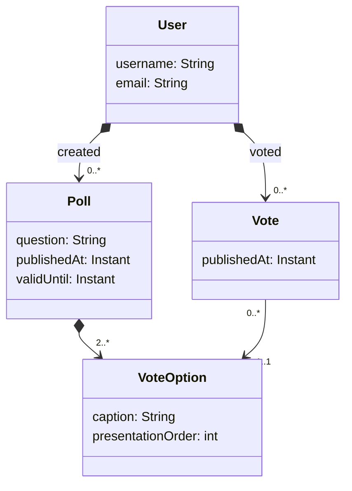

## DAT250: Software Technology Experiment Assignment 2

### Introduction

The goal of this assignment is to implement a simple REST API for Poll app using Spring Boot.
The problem description is given [here](../lectureexamples/l04_domain_serde/app/src/main/resources/descriptions/polls-domain.md)
and a first draft of the respective domain model is given below:



For this assignment, your task is to create a simple REST API (CRUD interface) for the domain model above, i.e. 
writing handlers for fetching (`@GetMapping`), creating (`@PostMapping`), updating (`@PutMapping`), and deleting (`@DeleteMapping`)
for `User`s, `Poll`s, `VoteOption`s, and `Vote`s in respective controller classes (annotated with `@RestController`).
You will have to think about whether all four CRUD operations are always applicable to every resource type.
Also, you will have to think about how you will want _to present_ the various resources, since the above domain model
contains association cycles a naive serialization will run into a buffer overflow.
Thus, you will have to think about what the [aggregates](https://martinfowler.com/bliki/DDD_Aggregate.html) in your domain model
are and how they should be rendered.
For this, you may want to consult the code examples from [lecture 04](../lectureexamples/l04_domain_serde/), especially
`@JsonIgnore`, `@JsonIdentityInfo`, `@JsonIdentityReference`, `@JsonManagedReference`, `@JsonBackReference`, or `@JsonView`
may serve useful :wink:

**Tipps**: You may have to find ways to identify users, polls, votes and voting options in the URLs.

### Step 0: Get a HTTP client for testing

While developing your REST API, it will be very useful to have an HTTP client at hand.
Depending on you previous experience and personal preference you may chose among many different options.

- [Bruno](https://www.usebruno.com/),
- [IntelliJ IDEA HTTP Client](https://www.jetbrains.com/help/idea/http-client-in-product-code-editor.html),
- [VS Code REST Client](https://marketplace.visualstudio.com/items?itemName=humao.rest-client),
- [HTTPie](https://httpie.io/),
- or the good'ol [curl](https://curl.se/).

If you don't know any of these from before, Bruno might be the easiest to get started with.
If you are an IDE enthusiast, the builtin clients in IDEA or VS Code are good options.
If you are a command line purist, you should go for HTTPie or even curl.

### Step 1: Set up Spring project repository

Use the result of the experiment from [last week](./expass1.md) as a starting point. 
First, you should upload this code by creating a new repository for it (if you already did this during epxeriment 1, you can skip
the following and keep working in that repository):

1. Go to <https://github.com/> and click on the `New` button below you username on the left side, where you see your repositories.
2. Choose `Public` visibility, give it a meaningful name and click on `Create repository`. Do not chose a Template, license, gitignore nor create a readme.
3. On you local machine, initialize a Git repository within the Sprin Boot application's root folder, commit the application files,
add a the newly created git repository as a remote and push your commits. For this, you may either use a graphical git client like [GitHub Desktop](https://desktop.github.com/download/) or the `git` command line interface. The required actions for the latter are described by GitHub when your repository is empty:

```sh 
cd ... # open a POSIX shell and navigate to your project folder 
git init # creates a new github repository
git add * # add all non-hidden files 
git add .gitignore # add the gitignore 
git commit -m "First commit" # commit the changes
git branch -M main # rename the main/master branch to "main" (if that is not already the case)
git remote add origin <your repo url from GitHub goes here> # add GitHub as a remote 
git push -u origin main # Upload your main branch to the remote and set it to tracking
```

### Step 2: Domain Model 

Implement the first draft of the _PollApp_ domain model, shown in the diagram above, in Java.
For the time being, the domain classes can be simple Java _Beans_, i.e. classes with little internal logic,
public getters- and setters for all properties, as well as a parameterless public constructor.
Moreover, you should create a `PollManager`-class, which will manage all domain objects in memory, e.g.
by holding `Poll`s and `User`s in a `HashMap`.
The `DomainManager` should be annotated with the `@Component` annotation, which will allow to _inject_ it into the 
controller classes.

### Step 3: Implement test scenarios 

Following a _Test-driven approach_, you should first design one or more test scenarios before starting to implement the 
handlers. You can either do this, by designing a sequence of requests in the HTTP client of choice.

One such scenarios that you app should support should look like this:

- Create a new user 
- List all users (-> shows the newly created user)
- Create another user 
- List all users again (-> shows two users)
- User 1 creates a new poll 
- List polls (-> shows the new poll)
- User 2 votes on the poll
- User 2 changes his vote
- List votes (-> shows the most recent vote for User 2)
- Delete the one poll
- List votes (-> empty)

### Step 4: Implement controller(s)

Use the `@RestController` and `@...Mapping` annotations to define handlers that realise the required behaviour.
Here, you will have to think about _resource identification_ (i.e. paths) and presentation (i.e. JSON de-/serialization).


### Step 5: Automate testing

Finally, your test scenarios should become code such that they can be run automatically without any user interaction.
You may choose whether you want to use the (proprietary) testing mechanisms of your HTTP client, or you can 
write them in Java, e.g. by using Spring's [`RestClient`](https://docs.spring.io/spring-framework/reference/integration/rest-clients.html#rest-restclient).

### Step 6: API documentation (optional)

Check out the [Springdoc](https://springdoc.org/) proect 
and add the following two dependencies to you `build.gradle.kts`:

```kotlin
	implementation("org.springdoc:springdoc-openapi-starter-webmvc-ui:2.6.0")
	implementation("org.springdoc:springdoc-openapi-starter-webmvc-api:2.6.0")
```

and visit <http://127.0.0.1:8080/swagger-ui.html> afterwards!
Can you recognize your handlers? Are they documented correctly?

Maybe you want to browse the [Springdoc examples](https://springdoc.org/#spring-cloud-function-web-support) on how 
customize the generated API documentation.

### Step 7: Build automation (optional)

Create a GitHub Actions workflow that runs the test scenarios that you created in _Step 6_ automatically.

### Hand-in: short report

You should write a short report about what you did in a markdown file `dat250-expass2.md`, which you should hand in via Canvas by posting the link to it.

In particular, you should write about:

- technical problems that you encountered during installation and how you resolved

- any pending issues with this assignment that you did not manage to solve

The hand-in should be written in **English**.
