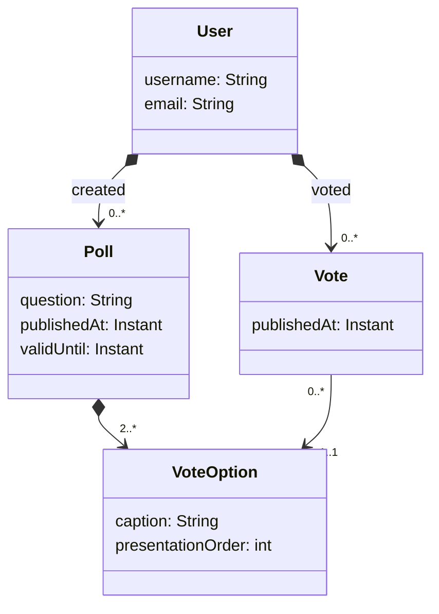

## DAT250: Software Technology Experiment Assignment 2

### Introduction

The goal of this assignment is to implement a simple REST API for Poll app using Spring Boot.
The problem description is given [here](../lectureexamples/l04_domain_serde/app/src/main/resources/descriptions/polls-domain.md)
and a first draft of the respective domain model is given below:

Your task is to create a simple REST API (CRUD interface) for the domain model above.

### Experiment 1: Set up Spring project

Use the result of the experiment from [last week](./expass1.md) as a starting point. 
First, you should create a new GitHub repository for your project. 
Follow the instructions, to commit your code and publish it to the repository.

- Create the domain model classes 
- Create a simple `DomainManager` class, which, for now (later we will replace this with a database repository), holds 
all the objects in memory by storing them into HashMaps. The class must be annotated with `@Component` so that it can be injected
into our REST controllers via Spring.
- Finally create REST Controllers with the respective annotations that handle GET, POST, PUT, and DELETE methods for our domain objects.

**Tipps**: You may have to find ways to identify users, polls, votes and voting options in the URLs.

### Hand-in: short report

You should write a short report in a markdown file `dat250-expass2.md`, which you should hand in via Canvas by posting the link to it.

In particular, you should write about:

- technical problems that you encountered during installation and how you resolved

- any pending issues with this assignment that you did not manage to solve

The hand-in should be written in **English**.
