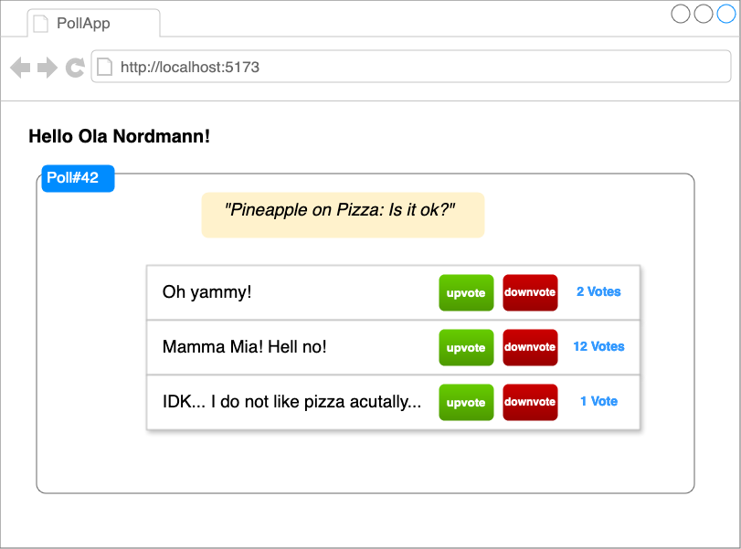

## DAT250: Software Technology Experiment Assignment 3

### Introduction

The goal of this assignment is to make initial experiments with front-end technologies for enterprise applications.
Your goal is develop web-based graphical user interface for your REST API from [last week](./expass2.md),
which allows to _create a user_, _create a poll_, _vote on a poll_. 
The GUI shall be realised as a _Single Page Application (SPA)_, comprising three components: `CreateUserComponent`, `CreatePollComponent`,
`VoteComponent`.

You can use the SPA-library/framework of your choice.
The potential candidates are:

- [Angular](https://angular.dev/)
- [React](https://react.dev/)
- [Vue.js](https://vuejs.org/)
- or [Svelte](https://svelte.dev/).

You can use the library/framework that you like the most/that you are most familiar with.
If you are not familiar with any of them, we recommend you to use svelte, which is also covered in the lecture.

### Step 1: Set up Node project

First, make sure that you have Node.js and NPM installed in the most recent version (as described in [Assignment 1](./expass1.md)).
You can check your versions by running:
```sh 
node -v
npm -v
```

Now, you can create your frontend project with 
```sh 
npm init vite@lates
```
This will open the set-up wizard from the JavaScript _Bundler_ [Vite](https://vitejs.dev/), which is used by most modern web frameworks.
The dialog will ask your first for a project name and then which framwork you want to use.
You can chose the one you are most comfortable with. The [lecture examples](../lectureexamples/l06_SPAs/) are using Svelte.
When you want to use Svelte, the easiest option is to go with the plain "_javascript_" variant (i.e. no TypeScript nor SvelteKit).
After the project has been set up, change your working directory and download the npm dependencies.

```shell
cd <project>
npm install
```

If you want to see the current state of the application, run the following:
```shell
npm run dev
```
This will point you to a URL that you can open in your browser.
We recommend to keep this development server in the background running during development so you can directly see you changes.

Next, delete all the pre-generated starter code to start from a clean slate.

### Step 2: Develop components 

Consult the documentation of the JavaScript framework that you are using on how to build user interface componments.
Your task is to build two components:
- One for creating a new poll, incl. the optionns 
- One for voting on a created poll.

For instance, the Poll-component may look something like this.



However, this is just a suggestion: It is up to you and your imagination how these components shall look like :wink:
We recommend, having some stub-data to test the initial layout and behaviour.

### Step 3: Enable CORS on the server side (for testing purposes)

Before we can start to integrate frontend and backend, 
we have to prepare the backend to support the right CORS-headers.
In Spring, this is easily done by adding the `@CrossOrigin` annotation to the respective `@Controller`s.
The easiest option is to simply add them to the top of each Controller class in you [code base from last week's exercise](./expass2.md)

If you want, you may have a more [detailed look](https://docs.spring.io/spring-framework/docs/current/javadoc-api/org/springframework/web/bind/annotation/CrossOrigin.html)
at this annotation an check how you can limit the allowed origins, methods, headers such that they fit to your current purpose 
(testing the API in production).

### Step 4: Integrate frontend and backend via `fetch`

Now, you are ready to let frontend and backend talk together.
Use the [`fetch()`](https://developer.mozilla.org/en-US/docs/Web/API/Fetch_API) function in order to retrieve polls, options, and votes.
Also, the mutational operations ("creating a poll", "making a vote") shall trigger a respective POST or PUT call to the [API that you developed last week](./expass2.md).


### Step 5: Deploy

When the development version of your SPA meets your expectations, it is time to deploy it by integrating it into the code base of your Poll App (API).
This is done by executing the 

```shell
npm run build
```
command, which will produce a few static assets (html, css, js) in the `/dist` directory.
Copy those files into your Spring Boot application at `/src/main/resources/static` and see what appens :)
(Do not forget to replace the absolute `http://localhost` URIs in you `fetch()` calls with relative URLs before going into production :wink:)

If you want to automate the whole process, create a `build.gradle.kts` file in you frontend project with the following content.

```kotlin
import com.github.gradle.node.npm.task.NpmTask

plugins {
    id("com.github.node-gradle.node") version "7.0.2"
}

node {
    version = "22.0.0"
    npmVersion = "10.5.1"
    download = true
}

tasks.register<NpmTask>("runBuild") {
    args = listOf("run", "build")
    workingDir = file(".")
}

tasks.register<Copy>("copyWebApp") {
    from("dist")
    into("../backend/src/main/resources/static")
    dependsOn("runBuild")
}

```

### Step 6: Extensions (optional)

Finally, you may have a look at the following extension possibilities (**all optional**):

- Instead of deploying a SPA as static assets into your Spring Boot application, you may want to consider using
 web application framework with server-side rendering like SvelteKit. This then means you are going to a more Microservice-like
 architecture. Here, you may want to check out the Caddy server, which can unify multiple servers behind a single endpoint (port)
 via it's reverse-proxy functionality.
- You may want to check out how you can implement a WebSocket-Server with Spring and use the JS `WebSocket` object to implement 
a fully bidirectional communication
- You may consider replacing the Poll REST API alltogether with a GraphQL API.


### Hand-in: short report

As hand-in, you must add a markdown file called `dat250-expass6.md` to the same repository that you created in the earlier software technology assignments.

In particular, you should write about:

- technical problems that you encountered during the completion of the tutorial

- a link to your code for experiments 1-2 above

- any pending issues with this assignment which you did not manage to solve

The hand-in should be written in **English**.
