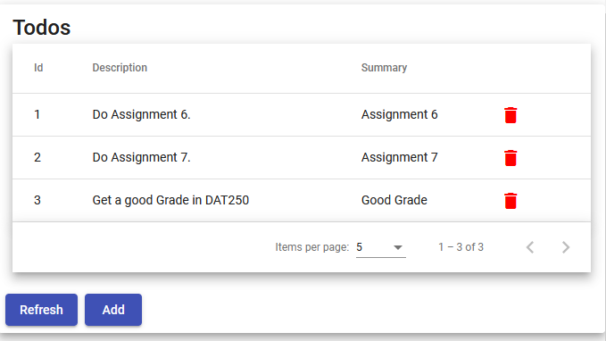

## DAT250: Software Technology Experiment Assignment 6

### Introduction

The goal of this assignment is to make initial experiments front-end technologies for enterprise applications.

### Experiment 1: Model-View-Controller Web Applications

Complete the tutorial on Spring MVC at: https://spring.io/guides/gs/serving-web-content/

### Experiment 2: Single-page applications
Use Angular to build a SPA to implement a **Todo list** (see example in experiment 3 below).
The application should use the Rest-API developed in assignment 4 and be able to:

1. Load todos using the Todo-API (HTTP GET),
2. Display all todos in a table, including a delete button in every row (HTTP DELETE),
3. Refresh displayed todos by clicking a button (HTTP GET),
4. Add a todo by giving its description and summary (HTTP POST).

See the lecture slides for information on installing Angular, loading data from a server, and display lists.
For this assignment, the application's functionality is critical, not the looks.

### Experiment 3: Using an SPA component library (optional)

Use a component libary such as [Angular Material](https://material.angular.io/guide/getting-started) for your application of experiment 2.
Try components such as [buttons](https://material.angular.io/components/button/overview), [inputs](https://material.angular.io/components/input/overview), [tabels](https://material.angular.io/components/table/overview) and [cards](https://material.angular.io/components/card/overview).
Your final application could look like this:

### Hand-in: short report

As hand in, you must add a markdown file called `dat250-expass6.md` to the same repository that you created in the earlier software technology assignments.

In particular, you should write about:

- technical problems that you encountered during the completion of the tutorial

- a link to your code for experiments 1-3 above

- any pending issues with this assignment which you did not manage to solve

The hand-in should be written in **English**.
