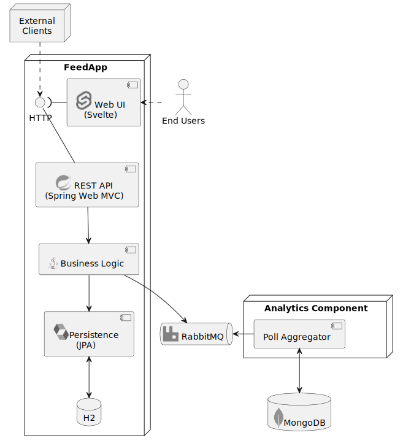

# Software Technology Project

The purpose of this document is to summarize the background and requirements of the DAT250 software technology project.
The formal aspects are covered primarily in the slides from the project introduction, which can be found on Canvas.

## FeedApp Prototype

The goal of the project is to develop a running prototype of a full-stack _FeedApp_ as it was initially introduced 
in [software technology experiment 2](../expassignments/expass2.md).
The purpose of this application is to allow users to create _polls_, either with simple yes/no-options or more customized
vote options. 
Registered or anonymous users can vote on polls using various interfaces, e.g. a web-based user interface or HTTP/REST
interfaces using a custom client/agent.

The domain logic of the application is kept deliberately simple in order to focus on the technological asects.
Your task is to apply all the technological components that are typically found in enterprise or cloud-based applications.

### Requirements

Concretely, the non-functional requirements are as follows:

1. There shall be a(n) (object-oriented) _Domain Model_ and custom _Business Logic_ for processing users, polls, and votes.
2. The FeedApp functionality must be exposed via a _REST API_ that incorporates _security aspects_ (session or token-based authentication and role-based authorization).
3. All domain entities are _persistently stored_ in a _relational database_ (object-relational mapping). 
4. There is a _Web UI_ implemented either as a Single or Multi Page Application
5. Each vote event shall trigger the FeedApp to send an aggregated presentation of each poll to an _analytical component_, which stores its data in a _NoSQL database_. That communication channel between the FeedApp and its analytical component shall be based on _messaging_ in order to decouple both of them.
6. The source code of the application must be in a publicly accessible _git repository_ and there must be a _CI-pipeline_ that automatically tests and builds the application, 
7. The application must be delivered as one or multiple _container images_ hosted in a public container registry

The resulting system architecture may look something like this:

### Technology Stack 

The technology stack to implement the aforementioned requirements is totally up to you!
Whithin the DAT250 course you have been exposed to a range of various technologies through the software technology experiments,
you are free to base your stack on those.

Currently (Fall 2024), this is
- [Java with SpringBoot](../expassignments/expass1.md) as the general platform/framework,
- [Spring Web MVC](../expassignments/expass2.md) for implementing a HTTP/REST API,
- [Svelte(Kit)](../expassignments/expass3.md) for implementing a Single Page App user interface,
- [Jakarta Persistence API with Hibernate and H2](../expassignments/expass4.md) for implementing object-relational database mapping,
- [MongoDB](../expassignments/expass5.md) as a non-relational database,
- [RabbitMQ](../expassignments/expass6.md) as a message broker,
- [Docker](../expassignments/expass7.md) as a container engine.

Additionally, you must choose **at leat one** technology not mentioned in the list above as part of your stack 
and perform a _technology aassessment_ according to Brown and Walnau on it. 

## Project Report

The final artifact (aside from the prototype application itself) is a _15 page report_.
It shall be written in [LaTeX](https://www.latex-project.org/get/) and based on [following template](https://github.com/selabhvl/dat250-projectreport-template).

The report shall have the following structure:

1. Introduction [~1 page]
2. Feed App Design [~5 pages]
3. Featured Technology [~6 pages]
4. Prototype Details [~2 pages]
5. Conclusion [~½ page]
6. References [~½ page]

Details about what each section shall contain is found in the template. 
The most important sections are the _design of the FeedApp_ and the assessment of the _featured technology_.

### FeedApp Design 

This section shall serve as the primary design document for you application i.e. it describes:

- the implemented _use cases_,
- the underlying _domain model_,
- the resulting _component architecture_.

Each aspect shall ideally be accompanied by a suitable diagram.
Uses cases can e.g. be described by means of a UML Use Case diagram.
Depending on what use cases, you chose to implement, the resulting diagram may look something like this:

The main purpose of the use case diagram is to highlight _what functionalities_ are implemented, _what actor ("roles")_ exist,
and _where (user) interfaces_ are required.

A domain model is usually depicted by means of an UML class diagram.
The purpose of this diagram is to highlight the core domain concepts and their relationships.
Also, the shown entities will become the classes in the _business logic layer_ of the resulting 
application and play an important role for the design of the object-relational mapping. 

A good starting point may be the following diagram:

Additionally, you shall mark whether classes are _entities_ or _value objects_.
Also, mark the _roots_ of your _aggregates_, which are used for serialization and (database) _repository_ design!

Finally, you shall provide a system architecture diagram as shown in the beginning of this document. 
The purpose of that diagram is to highlight what _components_ exist in you application and what _technologies_
are used to implement them.

To get some further inspiration on how such a design description may look like, please have a look at the 
[Open Phone Book Example](./phonebook.md).

### Technology Assessment

The most _unique_ part of your report will be the technology asssesment.
This assessment shall follow the methodology described in the paper by Brown and Walnau.

You shall start with shortly describing the technology's genealogy, i.e. where it comes from and what are its predecessors.
For this it may be useful to draw a _context graph_ as described in the paper, which will help to understand the context of 
the technology. 
Next, describe the technology's _problem habitat_, i.e. what concrete problem does the technology seek to solve or leverage.

In the second stage of Browns and Walnaus "technological delta" framework, you must formulate a set of _hypotheses_
about what benefits the application of that technology will bring.
Following from the hypotheses you design experiments that are meant to support to reject those hypotheses.
For instance, if you are looking into implementing a different type of communication protocol/RPC framework, which
promises to be "fast", you may design a performance evaluation where you meaure response or throughput rates compared
to technologies like HTTP/REST etc.

Finally, you report on your experiment results, your personal experience on working with the respective technology 
and demonstrate its role in your technology stack.

