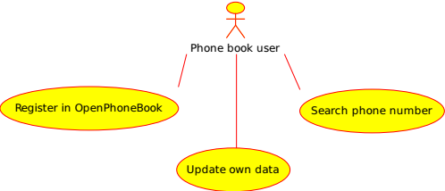
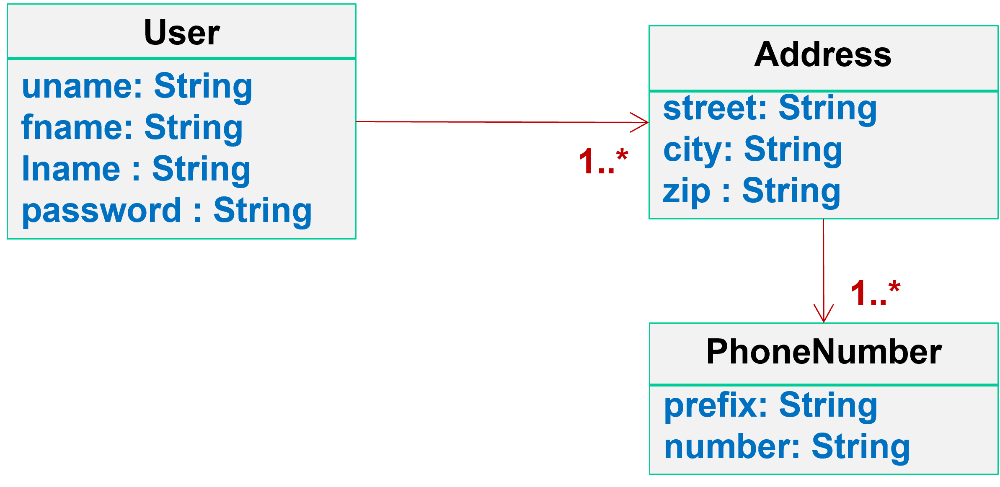
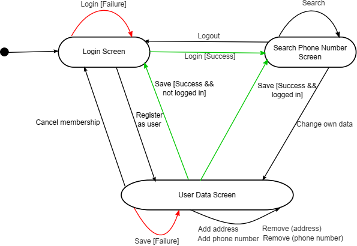
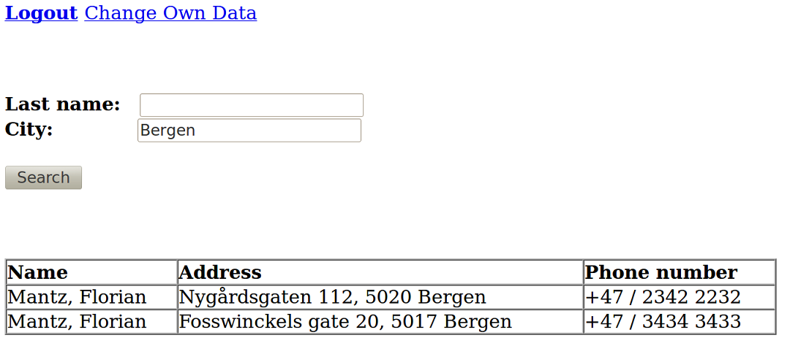
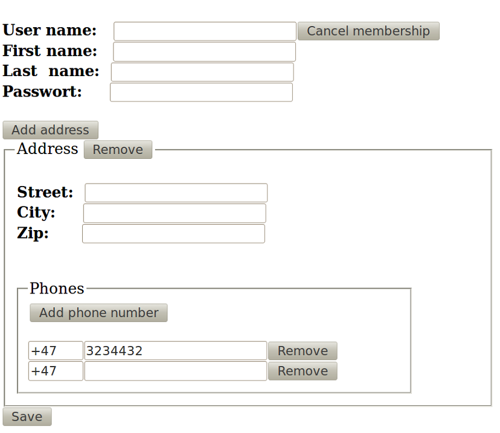

# The OpenPhoneBook example

The OpenPhoneBook example application should help you to create a proper design document. Use it as template for the application that you are going to develop. Note that the example does not contain the required IoT architectural diagram.

The OpenPhoneBook is an application for sharing phone numbers between registered users. Membership is free. Everyone can join the community by registering via a web form. Each logged-in user can search by last name as well as city for phone numbers of other registered users. Furthermore, each user can update his or her own information. Several addresses can be registered by each user and several phone numbers can be associated with an address. To keep it simple, mobile phone numbers are not handled in a special way.

## Use Cases

The use cases give an overview of the basic functionality to be provided by the application. Usually each use case is subsequently redefined in a set of more precise diagrams. However, in this application this is not necessary since the use cases are relatively simple. Therefore only a single use case diagram (see figure below) is created. This should be sufficient also in the case of your application.

* **Register in OpenPhoneBook:** Everyone can register his addresses and phone numbers via a web form.
* **Update own data:** Users of the OpenPhoneBook can change the data via another web form, e.g., if they have moved and got a new phone number.
* **Search phone number:** Each user can search for phone numbers of other users via their last name and/or city.

## Domain Model

The domain model shows the required concepts of the application and their relations. These are in this case *Users*, *Addresses* and *Phone Numbers*. These objects are stored in the database. Classes that encode application logic and helper classes are not part of the domain model.

The OpenPhoneBook application requires the concepts shown in the figure below. User names (uname) should be unique and passwords should be mandatory.

## Application Flow Diagram

Screen transitions (in the web application front-end) should be modelled using a basic state machine. Each screen should be modelled as state. Each action (button/link which can be pressed) should be modelled as transition (arrow). A condition (guard) for a transition is written in brackets `[guard]`.

Furthermore, transitions which result from possible errors should be coloured red. If there is a red transition, then there should be also a green one covering the case when an error did not occur. Uncoloured transitions can be merged if it makes sense (see: `Add address`, `Add phone number`, `Remove (address)` and `Remove (phone number)` have been merged to a single transition.

The application consists of three screens. Only logged-in users can search for phone numbers of other users. The `User Data Screen` has multiple uses. It is used for registering as a new user and also for updating user data. Button  `Cancel membership` deletes the user from the phone book. If the button is pressed by an unregistered user, the user is also sent to the `Login Screen` (nothing has to be deleted).

## User Screens

The user screen mock-ups is intended to prototype the application and give a better feeling how the application will work.

In `Login Screen` (see figure below) you can enter the application or be forwarded to a page were you can register as new user.

In `Search Phone Number Screen` (see figure below) each user can search by `Last name` and/or `City` for other users. Phone numbers found will appear in a table. If there is no result, a message `no matches` is shown instead of the table.

In `User Data Screen` (see figure below) a user can register as a new member, change his data or cancel his membership. Addresses are shown in a list. Each *Address* has a sublist containing all the phone numbers for the address. The data is validated when pressing the save button. It is checked that each set of data is complete. In addition, it is validated that the phone number is numerical. Furthermore, it is checked that the user adds add least one address and one phone number. Error messages shown are

* User data is not complete.
* Address <1> is not complete.
* Phone number <1> of Address <1> is not complete.
* Phone number <1> of Address <1> is not numeric.

